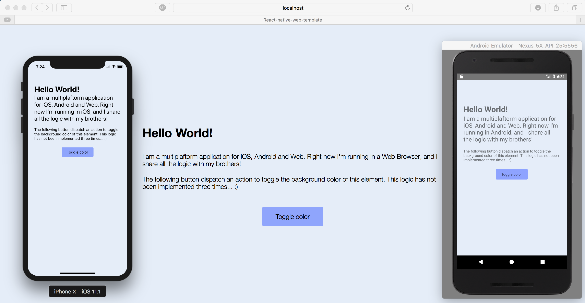

# react-native-web-template
This project is an amazing start point for building multiplattform applications for iOS, Android and browser sharing part of the code.

## Demo
Try the demo of the web application [here](https://react-native-web-template.herokuapp.com)

[https://react-native-web-template.herokuapp.com](https://react-native-web-template.herokuapp.com)

## Description
The code that is shared corresponds to the logic of the application:
- State of the application (redux):
    - Reducers
    - Actions
- i18n strings/texts.
- node_modules or dependencies.

On the other hand, this project contains two subprojects for rendering the corresponding views and components of each plattform:
- React-native for both Android and iOS (in `./app/native` folder).
- React project for web browser application (in `./app/web` folder).

## Project structure

```
.
├── actions
│   └── actions.js
├── i18n
│   └── index.js
├── native
│   ├── components
│   │   ├── Header.js
│   │   ├── Presentation.js
│   │   └── ToggleButton.js
│   ├── containers
│   │   ├── App.js
│   │   └── Root.js
│   └── styles
│       └── styles.js
├── reducers
│   └── index.js
├── store
│   ├── configureStore.dev.js
│   ├── configureStore.js
│   └── configureStore.prod.js
└── web
    ├── components
    │   ├── Header.js
    │   ├── Presentation.js
    │   └── ToggleButton.js
    ├── containers
    │   ├── App.js
    │   ├── Root.dev.js
    │   ├── Root.js
    │   └── Root.prod.js
    ├── index.js
    └── styles
        └── style.less

12 directories, 21 files
```

## Scripts

- `android-bundle`: to build the Android application in production mode (minified js).
- `android-dev-bundle`: to build the Android application in development mode.
- `clear-cache`: to clear the gulp cache if needed.
- `eslint`: to run the linter for checking the code styling rules.
- `ios-bundle`: to build the iOS application in production mode (minified js).
- `ios-dev-bundle`: to build the iOS application in development mode.
- `start`: to launch the react-native project.
- `web-bundle`: to build the web application in production mode with webpack (minified js).
- `web-dev-bundle`: to build the web application in development mode with webpack (hot reload).

## Get started - development environment
- Clone this repository:
`git clone https://github.com/NachoJusticia/react-native-web-template.git`
- Install dependencies: `npm install`

### Android
Check that you have specified in the file ./android/local.properties your NDK and SDK paths.

```
ndk.dir=/Users/[username]/Library/Android/sdk/ndk-bundle
sdk.dir=/Users/[username]/Library/Android/sdk
```

Then you can open an Android simulator and launch the command `react-native run-android`.

### iOS
Open the project with Xcode, choose a simulator and build the application or just launch the command `react-native run-ios`.

### Web
Launch the command `npm run web-dev-bundle` and open your favorite browser in `http://localhost:3001`.

## Screenshot



More screenshots can be found under `./screenshots` folder.

## Contributing
Contributors are welcome! Please fork this repository and make Pull Requests.
